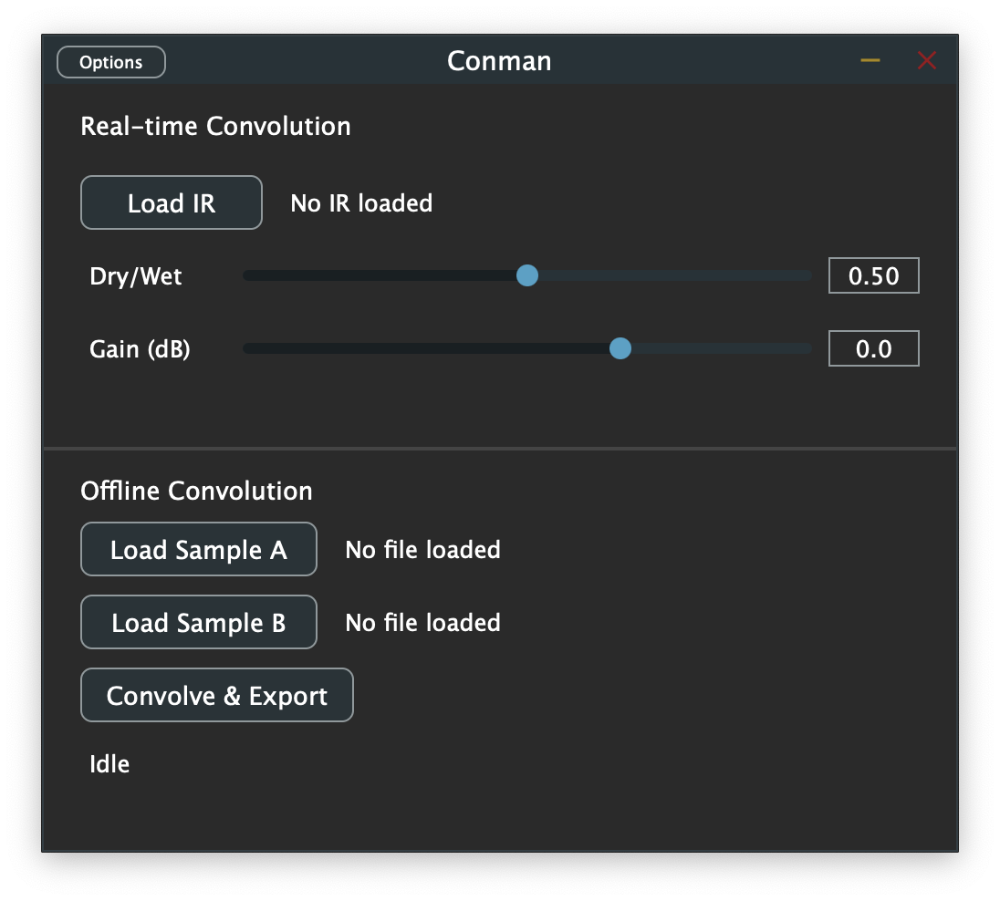

# Conman

A JUCE-based convolution tool available as a DAW plugin and a standalone application.



**Plugin (AUv3 / VST3)** — Load an audio imprint and convolve live audio input with it in real time (convolution reverb, cabinet simulation, etc.). Supports drag-and-drop imprint loading, dry/wet mix, and output gain controls.

**Standalone app** — Load two audio samples, convolve one with the other, and export the result as a 24-bit WAV file.

## Building

Requires CMake 3.22+ and a C++17 compiler. JUCE 8.0.4 is fetched automatically.

**macOS (with Xcode):**

```bash
cmake -B build -G Xcode
cmake --build build --config Release
```

**macOS / Linux (Makefiles):**

```bash
cmake -B build
cmake --build build --config Release
```

Build outputs are in `build/Conman_artefacts/Release/`:
- `AUv3/Conman.appex` — AUv3 plugin (macOS, requires Xcode)
- `VST3/Conman.vst3` — VST3 plugin (macOS/Linux/Windows)
- `Standalone/Conman.app` — Standalone application

## Installing (macOS)

```bash
# AUv3
cp -r build/Conman_artefacts/Release/AUv3/Conman.appex \
  ~/Library/Audio/Plug-Ins/Components/

# VST3
cp -r build/Conman_artefacts/Release/VST3/Conman.vst3 \
  ~/Library/Audio/Plug-Ins/VST3/
```

Rescan plugins in your DAW if needed.

## Usage

### Plugin (AUv3 / VST3)
1. Load an imprint WAV/AIFF/FLAC using the **Load Imprint** button or by dragging a file onto the plugin window
2. Adjust **Dry/Wet** to blend between the original and convolved signal
3. Adjust **Gain** to set the output level

### Standalone
1. Load two audio files using **Load Sample A** and **Load Sample B**
2. Click **Convolve & Export** and choose an output location
3. The result is written as a 24-bit WAV, normalized to prevent clipping

## License

[MIT](LICENSE)
